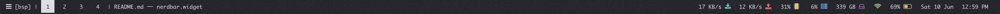
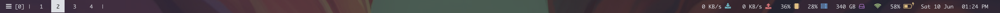

# Nerdbar

### Nerdbar Widget
* Displays `bsp`/`float`/`n/m` (monocle mode)  
* List of spaces, with active one highlighted with color  
* Name of focused window
* upload/download/mem/cpu/disk/wifi info 
* Battery percentage remaining (including whether it's charging) 
* Date and time 




Übersicht system information bar for use with kwm window manager. My nerdbar results from multiple successive forks, as well as my own changes:  
* [Herrbischoff's original nerdbar](https://github.com/herrbischoff/nerdbar.widget)
* [koekeishiya's modified nerdbar](https://github.com/koekeishiya/nerdbar.widget)
* [Amar1729's modified nerdbar](https://github.com/Amar1729/nerdbar.widget)
* [apierz's modified nerdbar](https://github.com/apierz/nerdbar.widget)

## Installation

Make sure you have [Übersicht](http://tracesof.net/uebersicht/) installed, and then clone this repository.    
```bash
# or wherever your ubersicht looks for widgets
git clone https://github.com/Widar91/nerdbar.widget $HOME/Library/Application\ Support/Übersicht/widgets/nerdbar.widget
```
